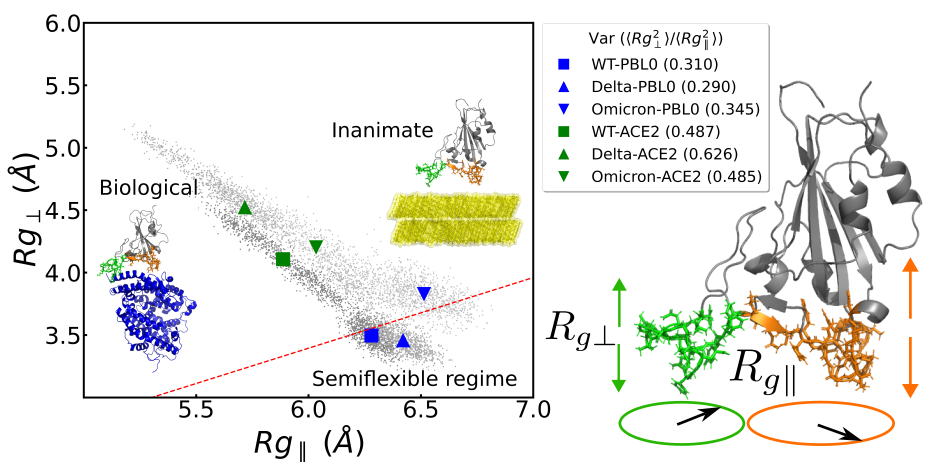
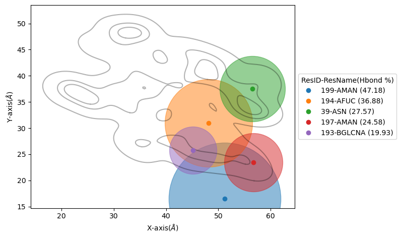

BioPolymer2D
----------------------------------------

This quick user guide includes instructions on how compute the following analysis:

 - Polar histogram analysis
 - Kernel Density Estimation contours
 - Parallel and perpendicular radii of gyrations
 - Hydrogen bonds per residues

Before any analysis, we must import ``MDAnalysis`` (since our class is initialized with a 
MDAnalysis AtomGroup or Universe), and our class.

.. code-block:: python

    import MDAnalysis as mda
    import matplotlib.pyplot as plt
    from twodanalysis import BioPolymer2D

We initialize our object using a MDAnalysis Universe, or a AtomGroup, and the selection of the surface inteface. Although, selecting the surface interface is not
mandatory it is highly recomended. In particular, if you expect to use polar histograms or any of the 2D density contour plot.

.. code-block:: python

    tpr = "md.tpr" # Replace this with you own topology file
    xtc = "md.xtc" # Replace this with your trajectory file

    universe = mda.Universe(tpr,xtc) # Define a universe with the trajectories
    sel=universe.select_atoms("protein") # Use any convinient selection.

    biopol = BioPolymer2D(sel, surf_selection='resname DOL and name O1 and prop z > 16')   # Initialize object by loading selection.

If `BioPolymer2D` is initialized with a Universe, the whole universe is considered to be the selection. We can also set our our biopolymer to be subset of ``universe`` or 
``sel`` by adding the input parameter ``biopol_selection`` with a subset selection. Notethat the biopolymer is not necesarilly a protein but can also be a nucleic acid. 

.. note::

    Polar histograms and the 2D density contour analyses use two parameters to filter frames where the biopolymer object is desorbed:
    
    - ``zlim``: Sets the minimal distance (in :math:`\mathring{\text{A}}`) residues need to have to the surface to be considered absorbed, e.i filters frames where :math:`\langle z_i\rangle_{\text{residues}}` > ``zlim``.
    - ``Nframes`` : Sets the number of frames to consider from the set of  :math:`\langle z_i\rangle_{\text{residues}}` < ``zlim`` frames. If ``Nframes=None``, it considers all frames.

    ``zlim`` will take as reference of the surface the mean value over time and atoms of the selected surface interface atoms selected at the initialization of the object  (``surf_selection`` input parameter).
    For this reason is importante that ``surf_selection`` *selects only the atoms at the interface of the surface* rather that the whole surface.

If we want to consider only a set of frames (or times) of the  whole trajectory, we can initialize as,for instance,

.. code-block:: python

    biopol = BioPolymer2D(sel, surf_selection='resname DOL and name O1 and prop z > 16',start=100,step=2,end=300)  

By default ``start``, ``step``, and ``end`` are parameters set in frames. If we rather set these parameters in time units (in ns), we can add ``by_frames=False`` as a input parameter.
These 3 parameters can be set independently (do not need to set them three if only one is wanted to be modified).

With ``INFO`` method we can retreive general information on our universe and selection, and we can set a system name with ``system_name`` 
attribute. Especially convinient if working with more than object at the same time, since the names will appear in the legends. 

.. code-block:: python

    biopol.system_name='Omicron PBL1'
    biopol.INFO()

In general, we would also like to compute the positions of the residues in our object. This will store position values of each frame 
of the center of mass (COM) of the residues of all its atoms on the ``pos`` attribute. Compute:

.. code-block:: python

    biopol.getPositions()

If you want to consider different set of frames than those used at the initialization of the object, The attributes ``startT``, ``endT``, and ``stepT`` 
(for setting times) or ``startF``, ``endF``, and ``stepF`` can be overwriten before computing ``getPositions``,e.g.

.. code-block:: python
    
    biopol.startT=100
    biopol.endT=200
    biopol.stepT=1
    biopol.INFO()
    biopol.getPositions()

``INFO`` to confirm that  ``startT``, ``endT``, and ``stepT`` have been overwriten.

Polar histogram analysis
^^^^^^^^^^^^^^^^^^^^^^^^

Since we are interested in only sampling the adsorption, ``PolarAnalysis`` method filters the frames in which the object is not 
adsorbed using a ``zlim`` and ``Nframes`` parameters. Frames in which minium position of residues in our ``select_res`` selection is lower than ``zlim`` to the surface,
are considered adsorbed.

Now, in general, the number of adsorbed frames will vary for different trajectories, and ,if we want to compare results between trajectories,
``Nframes`` paramater will set the number of frames we want to take from the total adsorbed frames, taking the ``Nframes`` frames where our 
``select_res`` selection is most adsorbed to be sampled in the histograms.

We compute the  ``PolarAnalysis``, setting these parameters,

.. code-block:: python

    select_res='resid 198 200 12 8 40 45 111 115 173'
    zlim=15
    Nframes=900
    hist_arr,pos_hist=biopol.PolarAnalysis(select_res,Nframes, 
                                                zlim=zlim,control_plots=False,plot=True)
    plt.show()

.. figure:: PolarHist.png
   :alt: Example of Polar Histograms
   :width: 100%
   :align: center

..    **Figure 1:** Example of output  Polar Histograms. 

If we only want to compute the histogram, and don't want any plot, we can set ``plot=False``. ``control_plots`` is to visualize the different steps of the PolarAnalysis calculations.
Titles and further figure customization can be added to the plot using standard ``matplotlib.pyplot`` methods before ``plt.show()``.

.. warning::
    **If ``surf_selection`` input parameter was not set in the object initialization**,  the surface in the trajectory will not set the ``z=0``, and ``zlim`` will not 
    work correctly, since it expects the surface intefarce with the protein to be the reference. 
    We suggest overwriting the ``surf_pos`` attribute with the position of the surface (<0,x,y,z> format) before computing the ``PolarAnalysis`` method. 
    Only the z value will be used. 
    
    .. code-block:: python

        surface_selection='resname DOL and name O1 and prop z > 16'
        surface_pos=biopol.getPositions(select=surface_selection, inplace=False)
        biopol.surf_pos=surface_pos

    With the ``inplace=False`` it will not overwrite the ``pos`` attribute of the object, but only return it.
    
Kernel Density Estimation (KDE) contours
^^^^^^^^^^^^^^^^^^^^^^^^^^^^^^^^^^^^^^^^

In general, we would like to have a reference of the position of the whole biopolymer to have insight ont the flexible regions. Therefore, 
we first compute the KDE of whole molecule, and then compute the KDE of selected residues:

.. code-block:: python

    paths=biopol.getKDEAnalysis(zlim,Nframes,) # Computes the paths of all the contour levels
    biopol.plotPathsInLevel(paths,0,show=False) # Plots paths in contour level 0
    # Plot the KDE contour plots of the selected residues
    all_residues_paths,residues_in_contour=biopol.KDEAnalysisSelection('resid 198 200 12 8 40 45 111 115 173',Nframes,zlim,show=False,legend=True)
    plt.show() # Can also set "show=True" if no plot customization is required.

.. note:: Setting the same ``zlim`` and ``Nframes`` paramater values for ``PolarAnalysis`` , ``getKDEAnalysis`` and ``KDEAnalysisSelection`` is suggested.

We now can compute the Areas of the paths computed by ``KDEAnalysisSelection`` with the ``getAreas`` attribute as follows:

.. code-block:: python

    data=[]
    for p in range(len(all_residues_paths)):
        areas=BioPolymer2D.getAreas(all_residues_paths[p],0,getTotal=True) # Stores the total area of contour level 0. 
        data.append([residues_in_contour.residues[p].resid,residues_in_contour.residues[p].resname,areas])
    df=pd.DataFrame(data=data, columns=["ResIDs", "Resnames", "Area (angs^2)"])
    df

``df`` will show a table with the areas of the outer contour levels (level 0 in ``getAreas`` , is outer).

Parallel and perpendicular radii of gyrations
^^^^^^^^^^^^^^^^^^^^^^^^^^^^^^^^^^^^^^^^^^^^^^

The parallel and perpendicular radii of gyration gives structural information during the adsorption,

* :math:`R_{g\parallel}`: Gives information on how the biopolymer is expanded by the sides (parallel to the surface). 

* :math:`R_{g\perp}` : Gives information on how the biopolymer is streched or flattened.

   **Figure 1:** Example of radii of gyration correlation figures that can be made with method on the left and a schematic 
   representacion of the parallel and perpendicular radii of gyrations on the right. Figure taken from the TOC figure of `Bosch et\. al`_ (2024).

To notice significant results, we need to select a region that is in contact with the surface as our object, e.g.

.. code-block:: python

    sel_in_Contact=universe.select_atoms('resid 4-15 or resid 34-45 or resid 104-117 or resid 170-176') # Select region in contact with surface
    Contact_region = BioPolymer2D(sel_in_Contact, surf_selection='resname DOL and name O1 and prop z > 16') # Initialize object
    Contact_region.system_name='Contact Omicron PBL1'# Set system name
    Contact_region.getPositions() # Compute positions
    ratio=Contact_region.RgPerpvsRgsPar(rgs, 'tab:green',show=False) # Make RgPerp vs Rg parallel plot
    
The output will be similar to Figure 1 (left), with only one system instead of six. Also, by default, small dot will be colored (and will represent the 
:math:`R_{g\perp}` and :math:`R_{g\parallel}` values at each frame), and bigger markers will be black (representing the mean values of the data). 
Example of this can be seen in `BioPolymer2D Tutorial`_ .
The ``ratio`` will give the :math:`\langle R_{g\perp}^2 \rangle /\langle R_{g\parallel}^2 \rangle` ratio, which is relevant on charactertizing the adsorption of polymers 
(`Egorov et\. al`_ (2016)`, `Milchev et\. al`_ (2020), `Poblete et\. al`_ (2021)). 

Hydrogen bonds per residues
^^^^^^^^^^^^^^^^^^^^^^^^^^^^
To the hydrogen bonds between two arbitrary selections of residues. In particular, you can compute the hydrogen bonds present between a biopolymer 
and a the surface as follows:

.. code-block:: python

    select_biopol='protein or resname AFUC BMAN AMAN BGLCNA' # Selection of protein and its glycan
    select_surf='resname DOL' # Selection of atoms present in the surfaces
    biopol.getHbonds(select_surf,select_biopol) # Compute H-bonds between surface and biopolymer

By default, the H-bond count will be stored in the attribute ``hbonds`` of the object, which can be changed to only returning the result setting 
``inplace=False`` in ``getHonds``.

To visualize these results, we suggest using the ``plotHbondsPerResidues`` method. Previous to use this method, you will need to compute a KDE contour plot
plot as a reference of the biopolymer.

.. code-block:: python

    paths=biopol.getKDEAnalysis(zlim,Nframes)
    biopol.plotHbondsPerResidues(paths,contour_lvls_to_plot=[0,5,8],top=5, print_table=True)
    plt.show()

..    **Figure 1:** Example of output  Polar Histograms. 

Here, you will be showing the contour levels 0 (outer), 5 (middle) and 8 (inner) as reference. Also, you will be plotting only the 5 residues with 
most H-bonds during the simulation (using ``top`` paramater), and with ``print_table`` we are setting to print a table with **all** the residues with their H-bond 
percentages during the simulation (note that these percentagesare shown for our ``top`` residues in the legend). We can add the ``filter`` input parameter to remove residue names we are not interested 
to see on the plot.

.. _Bosch et\. al: https://pubs.acs.org/doi/10.1021/acs.jcim.4c00460
.. _Poblete et\. al: https://pubs.acs.org/doi/10.1021/acsomega.1c04774
.. _Egorov et\. al: https://pubs.aip.org/aip/jcp/article-abstract/144/17/174902/194646/Semiflexible-polymers-under-good-solvent?redirectedFrom=fulltext
.. _Milchev et\. al: https://pubs.aip.org/aip/jcp/article/152/6/064901/307769/How-does-stiffness-of-polymer-chains-affect-their
.. _BioPolymer2D Tutorial: https://github.com/pyF4all/2DanalysisTutorials/blob/main/BioPolymer2D/BioPolymer2D_Tutorial.ipynb
