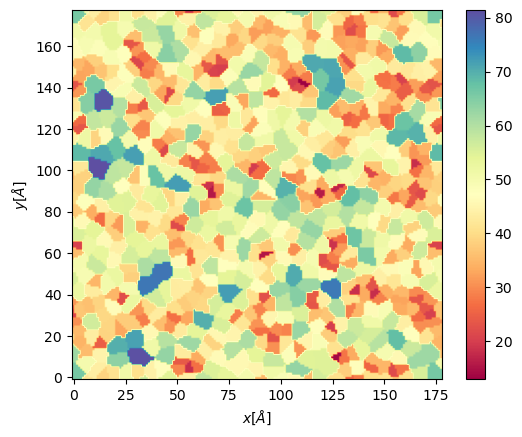

BioPolymer2D
----------------------------------------

This quick user guide includes instructions on how compute the following analysis:

 - Polar histogram analysis
 - Kernel Density Estimation contours
 - Parallel and perpendicular radii of gyrations
 - Hydrogen bonds per residues

Before any analysis, we must import ``MDAnalysis`` (since our class is initialized with a 
MDAnalysis AtomGroup or Universe), and our class.

.. code-block:: python

    import MDAnalysis as mda
    from twodanalysis import BioPolymer2D

And we initialize our object using a MDAnalysis Universe, or a AtomGroup. 

.. code-block:: python

    tpr = "md.tpr" # Replace this with you own topology file
    xtc = "md.xtc" # Replace this with your trajectory file

    universe = mda.Universe(tpr,xtc) # Define a universe with the trajectories
    sel=universe.select_atoms("protein") # Use any convinient selection.

    biopol = Biopolymer2D(sel)   # Initialize object by loading selection.

If `BioPolymer2D` is initialized with a Universe, the whole universe is considered to be the selection. Note 
that the biopolymer is not necesarilly a protein but can also be a nucleic acid. With ``INFO`` method we can 
retreive general information on our universe and selection, and we can set a system name with ``system_name`` 
attribute. Especially convinient if working with more than object at the same time, since the names will appear in the legends. 

.. code-block:: python

    ag_analysis.system_name='Omicron PBL1'
    ag_analysis.INFO()

In general, we would also like to compute the positions of the residues in our object. Compute:

.. code-block:: python

    ag_analysis.getPositions()

If you want to consider only a time section of your whole trajectory set the attributes ``startT``, ``endT``, and ``stepT`` before computing ``getPositions``,e.g.
.. code-block:: python
    ag_analysis.startT=100
    ag_analysis.endT=200
    ag_analysis.stepT=0.4
    ag_analysis.INFO()

``INFO`` to confirm that  ``startT``, ``endT``, and ``stepT`` have been overwriten.

Polar histogram analysis
^^^^^^^^^^^^^^^^^^^^^^^^

This code requires the number of bins, the edges, and the time interval that you want to use. Other options
are also available, check the documentation for mor information.

.. code-block:: python

    mat_thi, edges = membrane.thickness(50,           # nbins
                                        start = 61,   # Initial frame
                                        final = 110,  # Final Frame
                                        step = 1,     # Frames to skip
                                        )

The output is a matrix :math:`nbins\times nbins` and the edges in the form :math:`[xmin,xmax,ymin,ymax]`.

We can visualize with `plt.imshow`

 .. code-block:: python

    import matplotlib.pyplot as plt

    plt.imshow(mat_thi, extent=edges, cmap="Spectral")
    plt.xlabel("x $\AA$")
    plt.ylabel("y $\AA$")
    plt.title("Membrane thichness from frames 61-110")
    cbar = plt.colorbar()
    cbar.set_label('Thickness $\AA$')

 .. image:: thickness.png

Membrane order parameters
^^^^^^^^^^^^^^^^^^^^^^

The computation of order parameters is as easy as the computation of thickness. In this case
you can also choose which layer the analysis will run (top, bot, both). Follows an example of running order parameters

.. code-block:: python

    scd_top, edges = membrane.all_lip_order("top",
                                                50,
                                                start = 61,
                                                final=110,
                                                step = 1)
    scd_bot, edges = membrane.all_lip_order("bot",
                                                50,
                                                start = 61,
                                                final=110,
                                                step = 1)

Now we can plot the results

 .. code-block:: python

    from mpl_toolkits.axes_grid1 import make_axes_locatable
    # Plot
    fig, ax = plt.subplots(1,2, sharex = True, sharey = True)
    first = ax[0].imshow(scd_top, extent=edges, cmap="Spectral")
    ax[0].set_xlabel("x $\AA$")
    ax[0].set_ylabel("y $\AA$")
    ax[0].set_title("Top layer")
    divider1 = make_axes_locatable(ax[0])
    cax1 = divider1.append_axes("right", size="5%", pad=0.05)
    cbar = fig.colorbar(first, cax = cax1)
    # Point to a low ordered region
    ax[0].add_patch(patches.Rectangle((48, 98), 20,20, linewidth = 1, edgecolor = "black", facecolor = "none"))
    # High ordered region
    ax[0].add_patch(patches.Rectangle((90, 120), 20,20, linewidth = 1, edgecolor = "black", facecolor = "none"))

    second = ax[1].imshow(scd_bot, extent=edges, cmap="Spectral")
    ax[1].set_xlabel("x $\AA$")
    ax[1].set_title("Bot layer")
    divider2 = make_axes_locatable(ax[1])
    cax2 = divider2.append_axes("right", size="5%", pad=0.05)
    cbar = fig.colorbar(second, cax = cax2)
    cbar.set_label('|SCD| $\AA$')

 .. image:: scd.png

Here we highligted regions where the order parameters are low (red region) and high (blue region). From this region
the lipids looks as follows

 .. image:: image1aa.png

Packing defects
^^^^^^^^^^^^^^^

Packing defects is metric to evaluate the exposure of the hydrophobic core. It changes with membrane composition and
also when proteins interact with the membrane. The computation of packing defects with packmemb implies extracting pdb files
from the trajectories and then procesing them, which is time comsuming. Here we present an easy way to compute packing defects by
only providing the trajectory and the topology file. Also, our code outperforms packmemb, doing the computations faster.

The packing defects code is the following:

.. code-block:: python

    # Compute deffects for the first frame
    defects, defects_dict = membrane.packing_defects(layer = "top",         # layer to compute packing defects
                                                    edges=[10,170,10,170],  # edges for output
                                                    nbins = 400,            # number of bins
                                                    )

.. code-block:: python

    # Plot defects
    %matplotlib inline
    plt.imshow(defects, cmap = "viridis", extent = defects_dict["edges"])
    plt.xlabel("x  $[\AA]$")
    plt.ylabel("y  $[\AA]$")
    plt.show()

.. image:: packing_defects.png

For various frames to get statistics

.. code-block:: python

    data_df, numpy_sizes = membrane.packing_defects_stats(nbins = 400,
                                                      layer = "top",
                                                      periodic = True,
                                                      start = 0,
                                                      final = -1,
                                                      step=1)

.. image:: sizedefetc.png

Area perlipid
^^^^^^^^^^^^^

We include the posibility of get Voronoi APL. For one frame can be obtained as follows:

.. code:: python

    voronoi_dict = membrane.voronoi_apl(layer = "top")

This return a dictionary that contains the areas per each lipid in the top bilayer

We can further map this voronoi to a twod grid and plot it

.. code:: python

    xmin = membrane.v_min
    xmax = membrane.v_max
    ymin = membrane.v_min
    ymax = membrane.v_max
    apl, edges = membrane.map_voronoi(voronoi_dict["points"], voronoi_dict["areas"], 180, [xmin, xmax, ymin, ymax])

    plt.imshow(apl, extent = edges, cmap = "Spectral")
    plt.xlabel("$x [\AA]$")
    plt.ylabel("$y [\AA]$")
    plt.colorbar()

For multiples frames:

.. code:: python

    resu, edges = membrane.grid_apl(layer = "top", start = 10, final = 100, step = 1, lipid_list = None)

    plt.imshow(resu, extent = edges, cmap = "Spectral")
    plt.xlabel("$x [\AA]$")
    plt.ylabel("$y [\AA]$")
    plt.colorbar()

.. image:: multiple_apl.png

