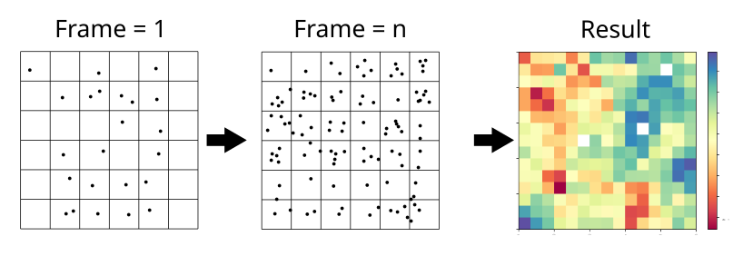
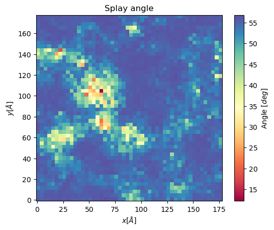
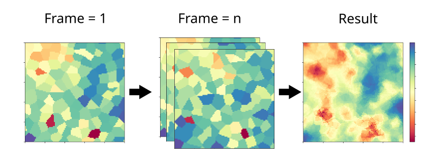
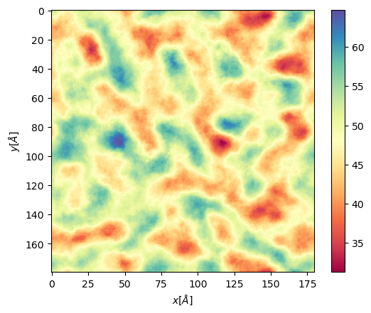
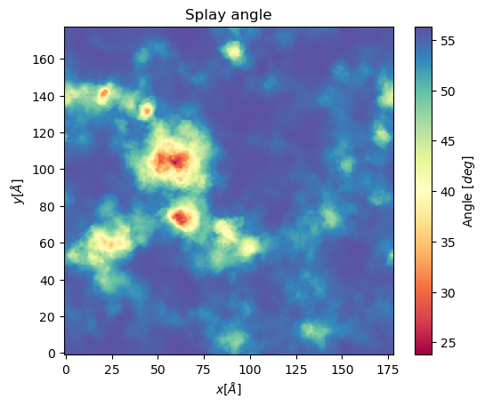
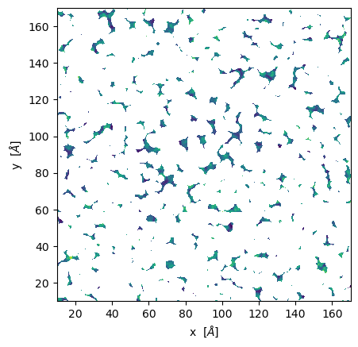
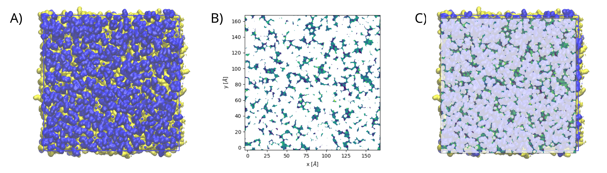
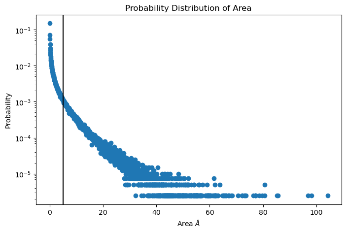

Membrane
--------

To study membranes in 2D fashion we developed 3 classes: :code:`Cumulative2D`, :code:`Voronoi2D`, and :code:`PackingDefects`.
The first two classes are useful to project membrane properties such as height in the 2D plane. Some of the properties
that we can currently project are:

 - Thickness
 - Order parameters (Only for Cumulative)
 - APL (Only for Voronoi)
 - Splay angle

On the other hand, Packing defects allows us to identify regions where the Hydrophobic core is exposed,
using a method implemented in PackMem. This method has been optimized and implemented in python.

Below you will find a quick explanation of how Cumulative2D, Voronoi2D, and PackingDefects works followed by some quick examples.

Cumulative2D
^^^^^^^^^^^^^^^^^^^^^^^^^^

`Cumulative2D` helps to project membranes properties in a two dimensional fashion, on a plane perpendicular to the z axis.
This class uses the protocol showed in the image below. First, we divide the space in a grid :math:`m\times m` and
we collect the x, y positions of each individual lipid, as well as the property of interest (i.e. height) across :math:`n` frames. Then, we check which lipids belong
to each grid square using their x, y positions and finally, we take the average for each grid square. The output is
a matrix :math:`m\times m` and its edges in the shape :math:`[x_{\text min},x_{\text max},y_{\text min}, y_{\text max}]`

To import :code:`Cumulative2D` you should type the following

.. code-block:: python

    import MDAnalysis as mda
    from twodanalysis import Cumulative2D

To use this class you should call the class using  and mda.AtomGroup or a mda.Universe as follows:

.. code-block:: python

    tpr = "membrane.tpr" # Replace this with you own membrane tpr or gro file
    xtc = "membrane.xtc" # Replace this with you xtc fila

    universe = mda.Universe(tpr,xtc) # Define a universe with the trajectories

    membrane = Cumulative2D(universe,   # load universe
                    verbose = False, # Does not print intial information
                    )

.. note::
    If your trajectory contains water and/or ions, we recommend you pass the list of lipids that
    compose the membrane by specifying :code:`lipid_list`.

Membrane Thickness
++++++++++++++++++

This code requires the number of bins, the edges, and the time interval that you want to use. Other options
are also available, check the documentation for mor information.

.. code-block:: python

    mat_thi, edges = membrane.thickness(50,           # nbins
                                        start = 61,   # Initial frame
                                        final = 110,  # Final Frame
                                        step = 1,     # Frames to skip
                                        )

The output is a matrix :math:`nbins\times nbins` and the edges in the form :math:`[xmin,xmax,ymin,ymax]`.

We can visualize with `plt.imshow`

 .. code-block:: python

    import matplotlib.pyplot as plt

    plt.imshow(mat_thi, extent=edges, cmap="Spectral")
    plt.xlabel("x $\AA$")
    plt.ylabel("y $\AA$")
    plt.title("Membrane thichness from frames 61-110")
    cbar = plt.colorbar()
    cbar.set_label('Thickness $\AA$')

 .. image:: thickness.png

Membrane order parameters
+++++++++++++++++++++++++

The computation of order parameters is as easy as the computation of thickness. In this case
you can also choose which layer the analysis will run (top, bot, both). Follows an example of running order parameters

.. code-block:: python

    scd_top, edges = membrane.all_lip_order("top",
                                                50,
                                                start = 61,
                                                final=110,
                                                step = 1)
    scd_bot, edges = membrane.all_lip_order("bot",
                                                50,
                                                start = 61,
                                                final=110,
                                                step = 1)

Now we can plot the results

 .. code-block:: python

    from mpl_toolkits.axes_grid1 import make_axes_locatable
    # Plot
    fig, ax = plt.subplots(1,2, sharex = True, sharey = True)
    first = ax[0].imshow(scd_top, extent=edges, cmap="Spectral")
    ax[0].set_xlabel("x $\AA$")
    ax[0].set_ylabel("y $\AA$")
    ax[0].set_title("Top layer")
    divider1 = make_axes_locatable(ax[0])
    cax1 = divider1.append_axes("right", size="5%", pad=0.05)
    cbar = fig.colorbar(first, cax = cax1)
    # Point to a low ordered region
    ax[0].add_patch(patches.Rectangle((48, 98), 20,20, linewidth = 1, edgecolor = "black", facecolor = "none"))
    # High ordered region
    ax[0].add_patch(patches.Rectangle((90, 120), 20,20, linewidth = 1, edgecolor = "black", facecolor = "none"))

    second = ax[1].imshow(scd_bot, extent=edges, cmap="Spectral")
    ax[1].set_xlabel("x $\AA$")
    ax[1].set_title("Bot layer")
    divider2 = make_axes_locatable(ax[1])
    cax2 = divider2.append_axes("right", size="5%", pad=0.05)
    cbar = fig.colorbar(second, cax = cax2)
    cbar.set_label('|SCD| $\AA$')

 .. image:: scd.png

Here we highligted regions where the order parameters are low (red region) and high (blue region). From this region
the lipids looks as follows
path_arr_arr,res=obj.KDEAnalysisSelection(select_res,Nframes=1000,zlim=15,show=False,legend=False)

Splay Angle
+++++++++++

Another property we can map to a 2D grid is splay angle. Splay angle is the aperture angle of
the two fatty acid chains of a lipid. For this, two vectors are defined as those that gro from the lipid
head (Usually P atom) to the last carbons in the lipid tails. The angle between these vectors is mapped with voronoi
and then averaged over  frames to get the following plot.

.. code:: python

    splay, edges = membrane.splay_matrix(lipid_list = ["DSPC", "DODMA", "POPE"],
                                            layer = "top",
                                            nbins = 150,
                                            start = 61,
                                            final = 110,
                                            step = 1)

.. code:: python

    plt.imshow(splay, extent = edges, cmap = "Spectral")
    plt.xlabel("$x [\AA]$")
    plt.ylabel("$y [\AA]$")
    plt.title("Splay angle")
    cbar = plt.colorbar()
    cbar.set_label('Angle $[\AA^2]$')

Voronoi2D
^^^^^^^^^^

`Voronoi2D` can also project properties in a 2D fashion, but it uses a different method to do so.
:code:`Voronoi2D` first constructs a Voronoi diagram using the positions of lipid head groups (typically
the phosphorus atoms), which is mapped into a :math:`m\times m` grid. During the mapping step, the value
of the desired property is assigned to the grid squares corresponding to each lipid.
This mapped grid is created for each frame, as illustrated in the figure below,
and then averaged across n frames. The output, similar to Cumulative2D, is a matrix :math:`m \times m`,
along with the edges :math:`[x_{\text{min}}, x_{\text{max}}, y_{\text{min}}, y_{\text{max}}]`.

To import :code:`Voronoi2D` you should type the following

.. code-block:: python

    import MDAnalysis as mda
    from twodanalysis import Voronoi2D

To use this class you should call the class using  and mda.AtomGroup or a mda.Universe as follows:

.. code-block:: python

    tpr = "membrane.tpr" # Replace this with you own membrane tpr or gro file
    xtc = "membrane.xtc" # Replace this with you xtc fila

    universe = mda.Universe(tpr,xtc) # Define a universe with the trajectories

    membrane = Voronoi2D(universe,   # load universe
                    verbose = False, # Does not print initial information
                    )

..note::
    If your trajectory contains water and/or ions, we recommend you pass the list of lipids that
    compose the membrane by specifying :code:`lipid_list`.

Membrane Thickness
++++++++++++++++++

This code requires the number of bins, the edges, and the time interval that you want to use. Other options
are also available, check the documentation for mor information.

.. code-block:: python

    lipids = membrane.lipid_list.copy()
    lipids.remove("CHL1")
    mat_thi, edges = membrane.voronoi_thickness(lipid_list=lipids,
                                            nbins = 150,           # nbins
                                            start = 61,   # Initial frame
                                            final = 110,  # Final Frame
                                            step = 1,     # Frames to skip
                                            )

The output is a matrix :math:`nbins\times nbins` and the edges in the form :math:`[xmin,xmax,ymin,ymax]`.

We can visualize with `plt.imshow`

 .. code-block:: python

    import matplotlib.pyplot as plt

    plt.imshow(mat_thi, extent = edges, cmap = "Spectral")

    plt.xlabel("x $[\AA]$")
    plt.ylabel("y $[\AA]$")

    plt.title("Membrane thickness from frames 61-110")
    cbar = plt.colorbar()
    cbar.set_label('Thickness $\AA$')
    plt.show()

 .. image:: voronoi_thickness.png

Area per lipid
++++++++++++++

We include the possibility of getting Voronoi APL. For one frame can be obtained as follows:

.. code:: python

    voronoi_dict = membrane.voronoi_properties(layer = "top")

This return a dictionary that contains the areas per each lipid in the top bilayer by accesing to
:code:`voronoi_dict["apl"]`.

We can further map this voronoi apl and take the mean over time by using:

.. code:: python

    areas, edges = membrane.voronoi_apl(layer = "top",
                                        nbins = 150,
                                        start = 61,
                                        final = 110,
                                        step = 1)

.. code:: python

    plt.imshow(areas, extent = edges, cmap = "Spectral")
    plt.xlabel("$x [\AA]$")
    plt.ylabel("$y [\AA]$")
    plt.title("Area per lipid")
    cbar = plt.colorbar()
    cbar.set_label('Area per lipid $[\AA^2]$')

Splay Angle
+++++++++++

Another property we can map to a 2D grid is splay angle. Splay angle is the aperture angle of
the two fatty acid chains of a lipid. For this, two vectors are defined as those that gro from the lipid
head (Usually P atom) to the last carbons in the lipid tails. The angle between these vectors is mapped with voronoi
and then averaged over  frames to get the following plot.

.. code:: python

    splay, edges = membrane.voronoi_splay(layer = "top",
                                            nbins = 150,
                                            start = 61,
                                            final = 110,
                                            step = 1)

.. code:: python

    plt.imshow(splay, extent = edges, cmap = "Spectral")
    plt.xlabel("$x [\AA]$")
    plt.ylabel("$y [\AA]$")
    plt.title("Splay angle")
    cbar = plt.colorbar()
    cbar.set_label('Angle $[\AA^2]$')

Packing defects
^^^^^^^^^^^^^^^

Packing defects is metric to evaluate the exposure of the hydrophobic core. It changes with membrane composition and
also when proteins interact with the membrane. The computation of packing defects with packmemb implies extracting pdb files
from the trajectories and then procesing them, which is time comsuming. Here we present an easy way to compute packing defects by
only providing the trajectory and the topology file. Our
code is able to compute packing defects for a single frame as well as for
full trajectories with several frames. Also, our code outperforms packmemb, doing the computations faster.

To use packign defects you should import the class as follows:

.. code-block:: python

    tpr = "membrane.tpr" # Replace this with you own membrane tpr or gro file
    xtc = "membrane.xtc" # Replace this with you xtc fila

    universe = mda.Universe(tpr,xtc) # Define a universe with the trajectories

    membrane = PackingDefects(universe,   # load universe
                    verbose = False, # Does not print intial information
                    )

For a single frame, say the frame 100 we can run

.. code-block:: python

    membrane.u.trajectory[100] # Compute deffects for the 80 frame
    defects, defects_dict = membrane.packing_defects(layer = "top",         # layer to compute packing defects
                                                    periodic = True,  # edges for output
                                                    nbins = 400,            # number of bins
                                                    )

To plot and visualize the packing defects you should run:

.. code-block:: python

    plt.imshow(defects, cmap = "viridis", extent = defects_dict["edges"]) # Plot defects
    plt.xlabel("x  $[\AA]$")
    plt.ylabel("y  $[\AA]$")
    plt.show()

Follows a comparison (C) of a plot made with VMD (A) and the packing defects computed with our code (B)

For various frames, to get statistics. Here, the return is a pandas dataframe and an array with the
sizes of the defects along the trajectory.

.. code-block:: python

    data_df, numpy_sizes = membrane.packing_defects_stats(nbins = 400,
                                                      layer = "top",
                                                      periodic = True,
                                                      start = 0,
                                                      final = -1,
                                                      step=1)

We can use this data to plot the probability of getting a packing defect of some areas

.. code-block:: python

    unique, counts = np.unique(numpy_sizes, return_counts = True)
    probabilities = counts/counts.sum()

    plt.figure(figsize=(8, 5))
    plt.scatter(unique*defects_dict["grid_size"]*defects_dict["grid_size"], probabilities)
    plt.xlabel('Area $\AA$')
    plt.yscale('log')
    plt.ylabel('Probability')
    plt.title('Probability Distribution of Area')
    plt.axvline(x = 5, color = "black")
    plt.show()

