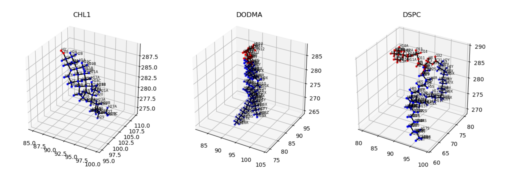

.. _when_problems_arise:
When problems arise
====================

Customizable lipids
+++++++++++++++++++

Customizing lipid heads
#######################

Our code will work perfectly and with zero to none user intervention as long as it is composed by cholesterol,
DODMA, and phospholipids that contains a P in their headgroup. For others lipids, including customized ones, we provide
an easy way to work with them. At initialize :code:`Voronoi2D`, :code:`Cumulative2D` or :code:`PackingDefects`,
the user should provide the headgroup they want to be taken into account for each lipid by passing :code:`working_lip`.
For example, for a membrane composed by "DSPC", "DODMA", "CHL1", and "POPE", we should provide

.. code-block:: python

    import MDAnalysis as mda
    from twodanalysis import Cumulative2D
    from twodanalysis import Voronoi2D

    # Dictionary containing the lipid heads to be used
    working_lip = {
        "DSPC": {"head" : "P"},
        "DODMA" : {"head" : "N"},
        "CHL1" : {"head": "O3"},
        "POPE" : {"head": "P"}
    }

    # Start Cumulative 2D or Voronoi2D
    # The following trajectories should be downloaded from zenodo (Only for test purposes)
    tpr = "md_membrane_nowater.tpr" # Replace with your tpr or gro file
    xtc = "md_membrane_nowater.xtc" # Replace with your xtc file
    univ = mda.Universe(tpr, xtc)
    membrane = Cumulative2D(univ, working_lip = working_lip)

    # or

    membrane = Voronoi2D(univ, working_lip = working_lip)

.. note::
    This method supports the inclusion of lipids that might otherwise produce errors, as well as user-defined and coarse-grained lipids.
    Additionally, users can specify any atom as the lipid headgroup, allowing for flexible selection—such as choosing a random atom from
    each lipid—for 2D projections with 2Danalysis. Users may also define multiple atoms as the headgroup; in this case, the algorithm
    calculates the center of mass of the selected atoms to represent the head. (This last feature is experimental and may not be compatible
    with all analyses.)

Customizing lipid tails
#######################

In cases such as splay angle, order parameters and packing defects, in addition to head information we need information of the tail.
Our code can automatically infer tail information for most standard lipids. However, there are exceptions—such as sterols, lipids with
a single tail, or those with more than two tails—where the automatic detection may not work as expected. In such cases, the user should
manually specify the bonds that connect the head to the tail. Below is an image rendered with VMD illustrating these bonds for CHL1, DODMA, and DSPC.

 .. image:: connection.png

The image above shows the atom names involved in the bonds that connect the lipid tails to the headgroup for various lipid types. These atom
pairs should be provided via the connection_chain attribute to ensure proper processing by 2Danalysis. Below is an example illustrating how
to define this attribute for the lipids shown (CHL1, DODMA, and DSPC).

.. code-block:: python

    import MDAnalysis as mda
    from twodanalysis import Cumulative2D
    from twodanalysis import Voronoi2D

    # Dictionary containing the connection of the chains
    connection_chains = {

            "CHL1" : [("O3", "C3")],
            "DODMA" : [("C21", "C22"), ("C31", "C32")],
            "DSPC" : [("C21", "C22"), ("C31", "C32")],

        }

    # Start Cumulative 2D or Voronoi2D
    # The following trajectories should be downloaded from zenodo (Only for test purposes)
    tpr = "md_membrane_nowater.tpr" # Replace with your tpr or gro file
    xtc = "md_membrane_nowater.xtc" # Replace with your xtc file
    univ = mda.Universe(tpr, xtc)
    membrane = Cumulative2D(univ, connection_chains = connection_chains)

    # or

    membrane = Voronoi2D(univ, connection_chains = connection_chains)

.. note::
    This method allows the inclusion of any lipid type into the 2Danalysis framework. For lipids with two tails,
    we recommend specifying the chains in the order sn1, sn2. The method also supports lipids with any number
    of tails—for example, a lipid with three tails should be defined using a list of three bonds. Using this
    approach, virtually any lipid can be incorporated, including custom-defined lipids and MARTINI coarse-grained lipids.

We also offer a nice way to check if the lipids tails are being assigned correctly by plotting them with :code:`visualize_polarity()` which would
output an image as follows:

.. code-block:: python

    membrane.visualize_polarity()
    plt.show()

Periodicity
+++++++++++++++++++

All components of our code handle periodic boundary conditions by replicating a portion of the data—by default, 10% along each edge.
However, in certain cases, especially when using Voronoi2D, this default replication may be insufficient, leading to unusually large
or visually distorted APL (Area Per Lipid) values. In such situations, users should increase the periodicity replication percentage as shown below.

.. code-block:: python

    import MDAnalysis as mda
    from twodanalysis import Cumulative2D
    from twodanalysis import Voronoi2D
    from twodanalysis import PackingDefects

    # The following trajectories should be downloaded from zenodo (Only for test purposes)
    tpr = "md_membrane_nowater.tpr" # Replace with your tpr or gro file
    xtc = "md_membrane_nowater.xtc" # Replace with your xtc file
    univ = mda.Universe(tpr, xtc)

    # For Cumulative2D
    membrane = Cumulative2D(univ)
    membrane.periodicity = 0.2 # Increase replication of data to 20%
    # For Voronoi2D
    membrane = Voronoi2D(univ)
    membrane.periodicity = 0.3 # Increase replication of data to 30%

    # For PackingDefects
    membrane = PackingDefects(univ)
    membrane.periodicity = 0.5 # Increase replication of data to 50%

.. note::
    Adjusting the periodicity replication is not necessary unless your visualizations are showing artifacts or errors. In most
    cases, especially when the edges of your system are much smaller than the size of the periodic box, the default setting is sufficient.

Other problems?
+++++++++++++++++++

If you encounter any other issues while using our code, feel free to open an issue on GitHub or contact the developers directly at
ricardox@buffalo.edu or vmonje@buffalo.edu. Please use the subject line "2Danalysis issue" when reaching out via email.
